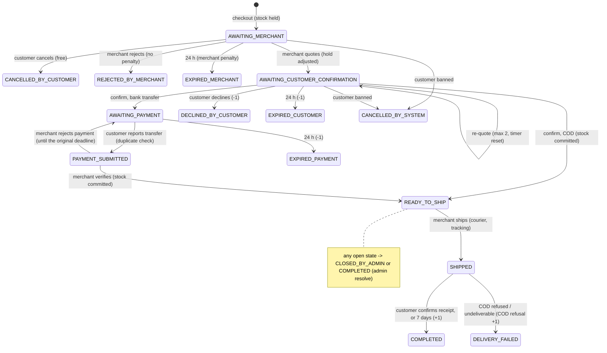

# order-service

Cart, checkout, orders and their state machine, bank-transfer payments and flagged references, shipments, customer
score and COD privilege, store-customer blocks, complaints, and the order deadline scheduler of the marketplace.
The design contract is [docs/marketplace-design.md](docs/marketplace-design.md), mainly sections 6, 7, 9 and 11.

- Java 25, Spring Boot 4.1.1, Spring Cloud 2025.1.3, Maven
- PostgreSQL with **Flyway** (`src/main/resources/db/migration/V1__init.sql`), `ddl-auto=validate`
- Config from the Config Server (`optional:configserver:http://localhost:8888`), registered in Eureka
- **JWT validation in the service** (RS256, user-service JWKS, issuer, audience, 30 s skew), deny-by-default rules,
  token revocation through the `SecurityStateFilter`. `X-User-Id` headers are no longer trusted (the old
  `GatewayUserHeaderFilter` is gone).
- OpenFeign + Resilience4j (Retry → CircuitBreaker → TimeLimiter) for every call to product-, store- and user-service
- **Transactional outbox** to the Kafka topic `order-events` (at-least-once); consumers of `user-events` and
  `store-events` de-duplicate by `eventId`
- ShedLock (JDBC) on every scheduled job
- Port **8083**

The old flow (client sends `userId`, stock decremented immediately, statuses `PENDING/CONFIRMED/FAILED/CANCELLED`,
`/api/orders`) has been removed entirely.

## Contents

- [Prerequisites](#prerequisites) · [Configuration](#configuration) · [Run](#run-locally)
- [Security](#security) · [Order state machine](#order-state-machine) · [Timers](#timers-and-holidays)
- [Checkout](#cart-and-checkout) · [Payments](#bank-transfer-payments) · [Scores, COD, blocks](#customer-score-cod-privilege-and-store-blocks)
- [API](#api) · [Events](#events) · [Settings](#platform-settings-used) · [Errors](#errors) · [Tests](#tests)

## Prerequisites

| Dependency | Default location | Used for |
|---|---|---|
| Config Server | `http://localhost:8888` | Shared config (JWKS URI, topics, client secret). Optional at startup |
| Eureka | `http://localhost:8761` | Finding user-, store- and product-service |
| user-service | Eureka id `user-service` (8081) | JWKS, service tokens, security state, the customer's own address and profile |
| store-service | Eureka id `store-service` (8084) | Store visibility/COD flag, bank accounts, couriers, platform settings, holidays |
| product-service | Eureka id `product-service` (8082) | Live price/stock quotes, stock reservations |
| PostgreSQL | `localhost:5434`, db `orderdb`, user/pass `orderservice` | `docker compose up -d postgres` |
| Kafka | `localhost:9092` | `docker compose up -d kafka` |

The schema is now created by Flyway. **Reset the old dev database once** before the first start:
`docker compose down -v`.

## Configuration

| Env var | Default | Purpose |
|---|---|---|
| `DB_HOST` / `DB_PORT` / `DB_NAME` | `localhost` / `5434` / `orderdb` | JDBC URL |
| `DB_USERNAME` / `DB_PASSWORD` | `orderservice` / `orderservice` | DB credentials |
| `CONFIG_SERVER_URL` | `http://localhost:8888` | Config Server |
| `EUREKA_URL` | `http://localhost:8761/eureka/` | Eureka |
| `KAFKA_BOOTSTRAP_SERVERS` | `localhost:9092` | Kafka |
| `JWKS_URI` | `http://localhost:8081/.well-known/jwks.json` | user-service public keys |
| `JWT_ISSUER` / `JWT_AUDIENCE` / `JWT_CLOCK_SKEW_SECONDS` | `user-service` / `marketplace` / `30` | Token checks |
| `SERVICE_CLIENT_SECRET_ORDER` | none | Client secret of `order-service` for `POST /internal/auth/service-token`. Required outside the `local` profile (startup fails with a placeholder or blank value) |
| `PAYMENT_ACCOUNT_ENCRYPTION_KEY` | none | AES-256-GCM key for depositor account numbers: base64 of 32 bytes (`openssl rand -base64 32`). Startup fails without it |
| `APP_TIMEZONE` | `Asia/Colombo` | Holiday dates |
| `KAFKA_TOPIC_USER_EVENTS` / `_STORE_EVENTS` / `_PRODUCT_EVENTS` / `_ORDER_EVENTS` | `user-events` / ... | Topic names |
| `SHEDLOCK_ENABLED` | `true` | Scheduler locks |

Other tunables (in `application.yml`, overridable through the Config Server): `app.scheduling.order-deadlines.*`
(interval 1 min, batch 100), `app.outbox.*` (relay every 1 s, batch 100), `app.platform.settings-ttl` (60 s),
`app.platform.holidays-ttl` (1 h), `app.orders.idempotency-ttl` (24 h), `app.orders.overdue-hold-extension` (30 d),
`app.orders.max-cart-lines` (100), `app.orders.max-line-quantity` (100), and the Resilience4j instances
`productService`, `storeService`, `userService` (2 attempts, 3 s timeout per attempt, breaker opens at 50 % of 10).

## Run locally

```bash
# 1. Config Server, Eureka, user-, store- and product-service (each in its own terminal)
# 2. PostgreSQL and Kafka for orders (reset once after the upgrade)
docker compose down -v && docker compose up -d postgres kafka
# 3. order-service
export SERVICE_CLIENT_SECRET_ORDER=...            # as registered in user-service
export PAYMENT_ACCOUNT_ENCRYPTION_KEY=$(openssl rand -base64 32)   # keep it: existing rows need the same key
mvn spring-boot:run
```

With Docker: `docker compose up --build` (same env vars, read from the shell or an uncommitted `.env`).

Swagger UI: http://localhost:8083/swagger-ui.html. `/internal/**` is never documented.

## Security

| Prefix | Who |
|---|---|
| `/api/customer/**` | `ROLE_CUSTOMER` |
| `/api/merchant/**` | `ROLE_MERCHANT`, or `ROLE_ASSISTANT` holding the route's permission (`ORDER_VIEW`, `ORDER_QUOTE`, `PAYMENT_VERIFY`, `ORDER_SHIP`, `CUSTOMER_BLOCK`) |
| `/api/admin/**` | `ROLE_ADMIN`, `ROLE_SUPER_ADMIN` |
| `/internal/**` | `ROLE_SERVICE` (none exposed by order-service yet) |
| anything else | denied (401 without a token, 403 with one) |

- Identity comes only from the JWT: the customer is the token's subject, the store is the token's `storeId`. Bodies
  and parameters never carry `userId`, `customerId`, `storeId`, `status`, prices or scores (unknown fields are
  ignored).
- Every merchant query is scoped by the JWT `storeId`, every customer query by the JWT subject. **A foreign id is a
  404**, never a 403.
- `SecurityStateFilter` rejects tokens whose `tv` is older than the user's current token version (401
  `TOKEN_REVOKED`). The cache is fed by `user-events` and asks user-service on a miss.
- `AccountGuard`: a banned customer can read orders but cannot check out, confirm a quote or pay
  (`CUSTOMER_BANNED`); a banned merchant keeps read access only. `BAN_GRACE` works as usual.
- **Service-to-service:** calls without a user context (scheduler, event handlers, store/product data) use a
  `ROLE_SERVICE` token from `ServiceTokenProvider` (cached until 30 s before expiry, refreshed after a 401). Calls
  made on a customer's behalf forward that customer's own token: the delivery address
  (`GET /api/users/me/addresses/{id}`) and contact (`GET /api/users/me`) at checkout.
- Depositor account numbers are encrypted at rest (AES-GCM, `v1:` format as in store-service) and shown masked
  (`****4567`). Store bank account numbers are shown in full only to the order's own customer while a transfer is
  expected, with `Cache-Control: no-store`.
- Free text (reasons, notes, complaints, objections, charge labels) is sanitized with the OWASP HTML Sanitizer.
- Every merchant, assistant, admin and system mutation writes an append-only `audit_log` row (a trigger rejects
  updates and deletes).

## Order state machine

All transitions go through `OrderStateMachine` (actor, permission and current-state guards; `@Version` checked
before any remote side effect, so a timer and a user action can never both win).



Plain-text version:

```
AWAITING_MERCHANT ──quote──▶ AWAITING_CUSTOMER_CONFIRMATION ──confirm (COD)──▶ READY_TO_SHIP ──ship──▶ SHIPPED ──▶ COMPLETED
   │ cancel / reject / 24 h      │ ▲ re-quote          │ confirm (bank)            ▲                     │
   ▼                              │ └─────┘              ▼                           │ verify              ▼
 CANCELLED_BY_CUSTOMER         decline / 24 h      AWAITING_PAYMENT ──submit──▶ PAYMENT_SUBMITTED   DELIVERY_FAILED
 REJECTED_BY_MERCHANT          DECLINED_BY_CUSTOMER     │ 24 h  ▲──reject payment──┘
 EXPIRED_MERCHANT              EXPIRED_CUSTOMER         ▼
                                                  EXPIRED_PAYMENT
any unconfirmed ──customer banned──▶ CANCELLED_BY_SYSTEM      any open ──admin──▶ CLOSED_BY_ADMIN | COMPLETED
```

Stock (product-service reservation keyed by the order's publicId): **reserved** at placement with expiry = the
merchant deadline; **adjusted** by the quote and whenever the deadline moves (the hold always expires with the
current timer); **committed** on `READY_TO_SHIP`; **released** on every terminal state without completion (not
after a commit: returning sold goods is a merchant stock edit).

## Timers and holidays

| Timer | Default | On expiry |
|---|---|---|
| Merchant response | 24 h | `EXPIRED_MERCHANT`, release, `merchantPenalty=RESPONSE_TIMEOUT` |
| Customer confirmation | 24 h | `EXPIRED_CUSTOMER`, release, customer -1 |
| Payment submission | 24 h | `EXPIRED_PAYMENT`, release, customer -1 |
| Payment verification | 24 h | stays open, `lateVerification`, `OrderVerificationOverdue` (`LATE_VERIFICATION`), hold extended 30 d |
| Ship-by | 72 h | stays open, `lateShipment`, `OrderShipmentOverdue` (`LATE_SHIPMENT`) |
| Auto-complete | 7 days after shipping | `COMPLETED`, customer +1 |

- `DeadlineCalculator` adds real hours and **skips every hour that falls on a holiday** (public or Poya, by
  `Asia/Colombo` date) from store-service `GET /internal/holidays`, cached per year and dropped on
  `HolidaysChanged`. A timer starting on a holiday starts at the next non-holiday midnight. Auto-complete is plain
  days.
- `OrderDeadlineScheduler` runs every minute under a ShedLock lock, reads due orders in batches, and claims each one
  in its own transaction with `SELECT ... FOR UPDATE SKIP LOCKED`, re-checking that it is still due. Handlers are
  idempotent; a failure (e.g. product-service down) leaves the order due for the next run.
- Users cannot act on a step whose timer has already run out (409 `DEADLINE_PASSED`), even before the scheduler
  runs.

## Cart and checkout

- `GET /api/customer/cart` re-prices every line live through product-service `POST /internal/variants/quote` and
  reports per line `available`, `availableQuantity` and an `issue` (`NOT_AVAILABLE`, `INSUFFICIENT_STOCK`,
  `REMOVED`). Lines from several stores are allowed.
- `POST /api/customer/checkout` (header `Idempotency-Key` required):

  ```json
  {"cartItemIds": ["CRT-2610-..."], "addressPublicId": "ADR-2610-...",
   "payments": [{"storePublicId": "STR-2610-...", "method": "BANK_TRANSFER"}]}
  ```

  Lines are grouped by store and **one order per store** is created under a shared `CHK-` group, each in its own
  transaction. If one store fails, the others still succeed; the response lists every group
  (`PLACED` with `orderPublicId`, or `FAILED` with `code` and `message`). **201** when at least one order was placed,
  **422** when none was. Failed lines stay in the cart; purchased lines leave it.
- Preconditions, each with its own code: customer active (`CUSTOMER_BANNED`), store visible and accepting orders
  (`STORE_NOT_ACCEPTING_ORDERS`), not blocked by the store (`CUSTOMER_BLOCKED_BY_STORE`), COD allowed
  (`COD_NOT_AVAILABLE_FOR_STORE`, `COD_NOT_ALLOWED_FOR_PRODUCT`, `COD_SUSPENDED`), open unconfirmed orders below
  `orders.max-open-unconfirmed-per-customer` (`OPEN_ORDER_LIMIT_REACHED`), items sellable and in stock
  (`VARIANT_NOT_AVAILABLE`, `INSUFFICIENT_STOCK`), address belongs to the caller (`ADDRESS_NOT_FOUND`).
- Prices are snapshotted per line (`listPrice`, `discountAmount`, `unitPrice`), the address and contact are
  snapshotted on the order. If anything fails after the stock hold, the hold is released again.
- **Idempotency** (checkout and payment submission): the outcome is stored per (user, key) with a hash of the
  request for 24 h. Same key + same request → the stored response is replayed (`Idempotent-Replayed: true`); same
  key + different request → 422 `IDEMPOTENCY_KEY_REUSED`; while the first is running → 409
  `IDEMPOTENCY_REQUEST_IN_PROGRESS`. Business refusals (4xx) are replayed too; 5xx/503 are not stored.

## Bank-transfer payments

1. After confirming, the customer reads the store's active accounts:
   `GET /api/customer/orders/{id}/bank-accounts`.
2. `POST /api/customer/orders/{id}/payments` (with `Idempotency-Key`):
   `{"referenceNumber", "sourceBankCode", "sourceAccountNumber", "storeBankAccountPublicId", "attachmentKeys"}`.
3. The reference is normalised (trim, upper-case, no spaces). If the pair (reference, destination bank) is already
   used by a `SUBMITTED` or `VERIFIED` payment **in any store**, the submission is refused with a generic
   409 `PAYMENT_REJECTED`, a `FLG-` row is written (with a pointer to the original use) and
   `PaymentReferenceFlagged` is published. A unique partial index settles races the same way. A reference whose
   payment was rejected by the merchant can be used again.
4. The merchant or an assistant with `PAYMENT_VERIFY` verifies (`READY_TO_SHIP`, stock committed) or rejects with a
   reason (back to `AWAITING_PAYMENT` until the original payment deadline).
5. Admins work the queue at `GET /api/admin/flagged-references` and mark each `REVIEWED` or `ESCALATED` (bans are
   done in user-service).

## Customer score, COD privilege and store blocks

- `customer_score_events`: completed +1 (on completion, not confirmation), declined or expired -1, all from
  settings. Merchant rejections (`OUT_OF_STOCK`, `LOW_CUSTOMER_SCORE`, `COD_HISTORY`, ...) carry no penalty.
- A failed delivery of a COD order counts one **COD refusal** without changing the score. The 3rd refusal
  (`score.customer.cod-refusal-limit`) suspends COD for `score.customer.cod-suspension-months` (3) and starts a new
  count. The customer may object within `cod.objection-window-days` (7); an admin `UPHELD` decision reverses that
  refusal and lifts a suspension it caused.
- Merchants see the customer's score and refusal count on every order. Admins see the full picture at
  `GET /api/admin/customers/{customerPublicId}/score`.
- Stores block their own customers (`CUSTOMER_BLOCK`); a blocked customer's checkout for that store fails with
  `CUSTOMER_BLOCKED_BY_STORE`.
- `user-events`: a banned customer's unconfirmed orders become `CANCELLED_BY_SYSTEM` (stock released, no penalty);
  when a merchant reaches `BANNED` (end of the 14-day grace), its open orders get `needsAdminResolution` and appear
  at `GET /api/admin/orders?needsResolution=true` for `FORCE_COMPLETE` or `CANCEL`.

## API

Public ids only (`ORD-`, `CHK-`, `PAY-`, `CMP-`, `FLG-`, cart lines `CRT-`). Lists are paged (`page`, `size` max 50,
100 for admins, `sort` from a whitelist, e.g. `placedAt,desc`).

### Customer (`ROLE_CUSTOMER`)

| Method | Path | |
|---|---|---|
| GET | `/api/customer/cart` | Cart, live prices, grouped by store |
| POST | `/api/customer/cart/items` | `{variantPublicId, quantity}` |
| PUT / DELETE | `/api/customer/cart/items/{cartItemId}` | Set quantity / remove line |
| DELETE | `/api/customer/cart` | Empty the cart |
| POST | `/api/customer/checkout` | One order per store (`Idempotency-Key`) |
| GET | `/api/customer/orders` | My orders (`status` filter) |
| GET | `/api/customer/orders/{id}` | Detail |
| POST | `/api/customer/orders/{id}/cancel` | Free, only `AWAITING_MERCHANT` |
| POST | `/api/customer/orders/{id}/confirm` | Accept the quote |
| POST | `/api/customer/orders/{id}/decline` | Decline the quote (-1) |
| GET | `/api/customer/orders/{id}/bank-accounts` | Store accounts to pay into |
| POST | `/api/customer/orders/{id}/payments` | Report a transfer (`Idempotency-Key`) |
| POST | `/api/customer/orders/{id}/received` | Mark received (completes, +1) |
| POST | `/api/customer/orders/{id}/cod-objection` | Object to a COD refusal |
| POST / GET | `/api/customer/complaints` | File / list complaints |
| GET | `/api/customer/complaints/{id}` | Complaint detail |

### Merchant and assistants

| Method | Path | Permission |
|---|---|---|
| GET | `/api/merchant/orders`, `/api/merchant/orders/{id}` | `ORDER_VIEW` |
| POST | `/api/merchant/orders/{id}/reject` `{reasonCode, note}` | `ORDER_QUOTE` |
| POST | `/api/merchant/orders/{id}/quote` `{lines, courierCode, courierCharge, otherCharges, quoteDiscount}` | `ORDER_QUOTE` |
| POST | `/api/merchant/orders/{id}/payment/verify` | `PAYMENT_VERIFY` |
| POST | `/api/merchant/orders/{id}/payment/reject` `{reason}` | `PAYMENT_VERIFY` |
| POST | `/api/merchant/orders/{id}/ship` `{courierCode, trackingNumber}` | `ORDER_SHIP` |
| POST | `/api/merchant/orders/{id}/delivery-failed` `{type: COD_REFUSED or UNDELIVERABLE, note}` | `ORDER_SHIP` |
| GET | `/api/merchant/orders/complaints`, `/api/merchant/orders/complaints/{id}` | `ORDER_VIEW` |
| POST | `/api/merchant/orders/complaints/{id}/response` `{response}` (once) | `ORDER_QUOTE` |
| GET / POST | `/api/merchant/customer-blocks` `{customerPublicId, reason}` | `CUSTOMER_BLOCK` |
| DELETE | `/api/merchant/customer-blocks/{customerPublicId}?reason=` | `CUSTOMER_BLOCK` |

Quote rules: lines may only be reduced or removed (at least one stays), the courier charge is mandatory and the
courier must be one of the store's active couriers (and collect cash for COD orders), labelled other charges and a
quote discount are optional, at most `orders.max-quote-revisions` re-quotes, each restarting the customer's timer.
Shipping: the tracking number must match the courier's regex; the tracking link comes from its URL template.

### Admin (`ROLE_ADMIN`, `ROLE_SUPER_ADMIN`)

| Method | Path | |
|---|---|---|
| GET | `/api/admin/orders?status=&needsResolution=` | Orders |
| GET | `/api/admin/orders/{id}` | Detail with customer insight |
| POST | `/api/admin/orders/{id}/resolve` `{action: FORCE_COMPLETE or CANCEL, reason}` | Resolve (audited) |
| GET | `/api/admin/orders/cod-objections?status=` | COD objections |
| POST | `/api/admin/orders/{id}/cod-objection/decision` `{decision: UPHELD or DISMISSED, note}` | Decide |
| GET | `/api/admin/complaints?status=`, `/api/admin/complaints/{id}` | Complaints |
| POST | `/api/admin/complaints/{id}/decision` `{decision: UPHELD or DISMISSED, notes}` | Decide |
| GET | `/api/admin/flagged-references?status=`, `/api/admin/flagged-references/{id}` | Duplicate references |
| POST | `/api/admin/flagged-references/{id}/review` `{action: REVIEWED or ESCALATED, note}` | Review |
| GET | `/api/admin/customers/{customerPublicId}/score` | Score, COD refusals, suspension |

### Calls to other services

| Service | Endpoint | Token |
|---|---|---|
| user-service | `POST /internal/auth/service-token`, `GET /internal/users/{id}/security-state` | client credentials / service |
| user-service | `GET /api/users/me/addresses/{id}`, `GET /api/users/me` | the customer's own |
| store-service | `GET /internal/stores/{id}`, `/{id}/bank-accounts`, `/{id}/couriers`, `GET /internal/settings`, `GET /internal/holidays?from=&to=` | service |
| product-service | `POST /internal/variants/quote`, `POST /internal/reservations`, `PUT /internal/reservations/{orderRef}`, `POST .../{orderRef}/commit`, `POST .../{orderRef}/release` | service |

## Events

Published to **`order-events`** through the outbox (same transaction as the change; `OutboxRelay` publishes every
second under ShedLock, in order, at-least-once), keyed by the order UUID. Every message has `eventId`,
`eventType`, `occurredAt`, `orderId`, `orderPublicId`, `storeId`, `storePublicId`, `customerId`,
`customerPublicId`, `status`, `previousStatus`, `paymentMethod`, totals (`itemsTotal`, `courierCharge`,
`otherChargesTotal`, `quoteDiscount`, `grandTotal`), `placedAt` and `lines` (`variantId`, `variantPublicId`,
`itemPublicId`, `quantity`). No address, phone or account number is ever published.

| Event | When | Extra fields |
|---|---|---|
| `OrderPlaced` | Checkout created the order | `checkoutPublicId` |
| `OrderQuoted` | Quote / re-quote | `quoteRevision` |
| `OrderConfirmed` | Customer accepted | |
| `OrderPaymentSubmitted` | Transfer reported | |
| `OrderPaymentVerified` / `OrderPaymentRejected` | Merchant decision | `reason` |
| `OrderShipped` | Shipped | `courierCode` |
| `OrderCompleted` | Received, auto-completed, or admin force-complete | `resolution` for admins |
| `OrderCancelled` | Every terminal state without completion | `terminalStatus`, `reason`, `merchantPenalty=RESPONSE_TIMEOUT` (merchant timeout), `customerPenalty=DECLINED/EXPIRED`, `resolution=CANCEL` (admin) |
| `OrderDeliveryFailed` | COD refused / undeliverable | `deliveryFailureType` |
| `OrderShipmentOverdue` | Ship-by missed | `merchantPenalty=LATE_SHIPMENT` |
| `OrderVerificationOverdue` | Verification missed | `merchantPenalty=LATE_VERIFICATION` |
| `OrderNeedsAdminResolution` | Merchant banned with the order open | |
| `PaymentReferenceFlagged` | Duplicate reference refused | `flaggedReferencePublicId` |
| `ComplaintDecided` | Admin decided a complaint | `complaintPublicId`, `decision`, `merchantPenalty=COMPLAINT_UPHELD` when upheld |

Consumed (group `order-service`, idempotent through `processed_events`):

| Topic | Event | Reaction |
|---|---|---|
| `user-events` | `UserSecurityChanged`, `UserStatusChanged` | Security-state cache (token version, status) |
| `user-events` | `UserStatusChanged` customer `BANNED` | Unconfirmed orders → `CANCELLED_BY_SYSTEM` |
| `user-events` | `UserStatusChanged` merchant `BANNED` | Open orders → `needsAdminResolution` |
| `store-events` | `SettingsChanged` / `HolidaysChanged` | Drop the settings / holiday cache |

## Platform settings used

Read from store-service `GET /internal/settings` (cached 60 s, dropped on `SettingsChanged`), never hard-coded:

`timers.merchant-response-hours`, `timers.customer-confirmation-hours`, `timers.payment-submission-hours`,
`timers.payment-verification-hours`, `timers.ship-by-hours`, `timers.auto-complete-days`,
`score.customer.completed`, `score.customer.declined`, `score.customer.expired`, `cod.objection-window-days`,
`score.customer.cod-refusal-limit`, `score.customer.cod-suspension-months`,
`orders.max-open-unconfirmed-per-customer`, `orders.max-quote-revisions`, `complaints.window-days`.

If store-service is unreachable the last known values are kept; with none at all the request fails with 503.

## Errors

Every error has the same JSON shape plus a stable `code`:

```json
{"timestamp": "2026-10-01T10:15:30Z", "status": 409, "error": "Conflict", "code": "QUOTE_REVISION_LIMIT_REACHED",
 "message": "The quote was already revised 2 times", "path": "/api/merchant/orders/ORD-2610-7K2M9Q/quote"}
```

| Status | Typical codes |
|---|---|
| 400 | `VALIDATION_FAILED`, `MALFORMED_REQUEST`, `INVALID_SORT`, `IDEMPOTENCY_KEY_REQUIRED`, `INVALID_QUOTE`, `COURIER_NOT_AVAILABLE`, `INVALID_TRACKING_NUMBER`, `PAYMENT_METHOD_MISSING`, `BANK_ACCOUNT_NOT_AVAILABLE` |
| 401 | `UNAUTHORIZED` (missing/invalid/expired token), `TOKEN_REVOKED` |
| 403 | `ACCESS_DENIED` (role or permission), `CUSTOMER_BANNED`, `CUSTOMER_BLOCKED_BY_STORE`, `COD_SUSPENDED` |
| 404 | `NOT_FOUND` (also someone else's order), `CART_ITEM_NOT_FOUND`, `ADDRESS_NOT_FOUND`, `VARIANT_NOT_AVAILABLE` |
| 409 | `INVALID_ORDER_STATE`, `DEADLINE_PASSED`, `QUOTE_REVISION_LIMIT_REACHED`, `PAYMENT_REJECTED`, `INSUFFICIENT_STOCK`, `STORE_NOT_ACCEPTING_ORDERS`, `OPEN_ORDER_LIMIT_REACHED`, `CONCURRENT_MODIFICATION`, `IDEMPOTENCY_REQUEST_IN_PROGRESS`, `OBJECTION_*`, `COMPLAINT_*` |
| 422 | `IDEMPOTENCY_KEY_REUSED`; checkout where no store group could be placed (body = per-group results) |
| 503 | `SERVICE_UNAVAILABLE`: product-, store- or user-service down, timed out, or its breaker open |

## Tests

```bash
mvn clean package   # unit + integration tests (Docker required for Testcontainers)
```

Integration tests run the whole application against PostgreSQL (Testcontainers), an embedded Kafka broker, and one
WireMock server standing in for user-, store- and product-service (JWKS, service token, settings, holidays, stores,
a fake catalog, reservations). The clock is a `MutableClock`, so timers are tested by moving time.

| Class | Covers |
|---|---|
| `DeadlineCalculatorTest` | Plain hours; starting just before, inside, and across single and multi-day holiday runs; month boundary; Colombo vs UTC dates; broken calendars |
| `OrderTest`, `ReferenceNormalizerTest` | Totals, removed lines, status groups, confirmation target; reference normalisation |
| `AuthorizationMatrixTest` | Every endpoint × anonymous, customer, merchant, assistant with/without permission, admin, super admin, service token; removed `/api/orders` is denied |
| `OwnershipTest` | Customer A vs B, merchant A vs B, assistants without the route permission, foreign store assistants, complaints |
| `OrderFlowIntegrationTest` | Full COD and bank-transfer happy paths (incl. a rejected payment), stock reserve/adjust/commit, event payloads |
| `OrderLifecycleTest` | Merchant timeout, customer decline and timeout, payment timeout, rejection, cancel, delivery failed, auto-complete, ship-by and verification overdue, re-quote limit, quote rules, tracking number validation |
| `CheckoutIntegrationTest` | Partial checkout across stores, idempotent checkout, open-order cap, blocked customer, COD per product, stock refusal, live cart, banned customer, smuggled server fields |
| `PaymentFlaggingTest` | Duplicate reference across stores → generic refusal, `FLG-` row, event, admin review |
| `CodPrivilegeAndBlocksTest` | 3rd refusal suspends COD, objection upheld lifts it, objection window, store blocks |
| `BanReactionsTest` | Banned customer (unconfirmed cancelled, confirmed kept, revoked token), banned merchant (admin resolution), duplicate events |
| `ComplaintsTest` | File, respond once, uphold with penalty hint, window |
| `SchedulerConcurrencyTest` | Two scheduler instances at once never double-process |
| `OrderEventsIntegrationTest` | Outbox relay to Kafka (key = order UUID), `user-events` consumed once despite redelivery |
| `OpenApiDocsTest` | Docs public, no `/internal/**`, no removed endpoints |

## Known limitations

- Reservation calls run inside the order's transaction after the version check. If product-service applied a
  call but the order's commit then failed, the next transition repeats it (all reservation calls are idempotent);
  a release that went through for an order that stayed open is caught when the order later commits (409) and must
  be resolved by an admin.
- After `DELIVERY_FAILED` or an admin close of a shipped order, the committed stock is not returned automatically;
  the merchant restocks with a stock edit.
- The idempotency store keeps the response body as JSON text; very large responses are stored as they are.
